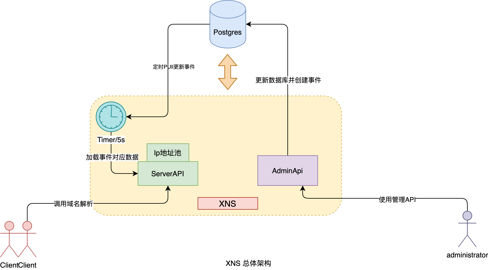
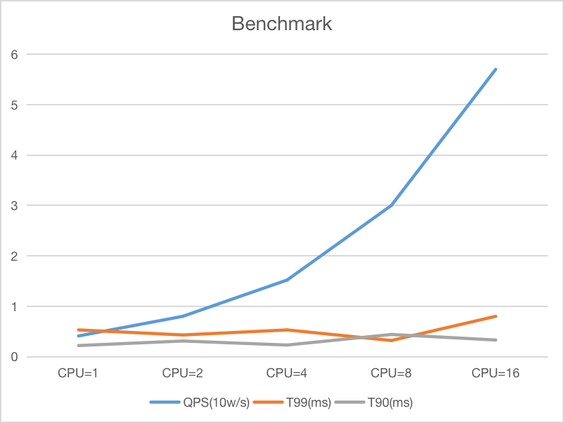

# 什么是XNS

XNS 是一个基于golang fasthttp 框架构建的一个高效的httpDNS 服务，目前已经在讯飞云实践，承担着讯飞云大部分流量调度的任务。
httpDNS是一种提供http协议域名解析的服务。
支持自定义各种解析规则，满足不同的域名解析场景。能够根据用户所在地，就近分发最近，最优的地址(实现该功能需要ip地址池)。
同时使用httpDNS 可以绕过运营商的DNS解析，实现流量秒级切换，没有运营商DNS的解析残留问题。

# 特性
- 域名防劫持 
使用HTTP（HTTPS）协议进行域名解析，域名解析请求直接发送至HTTP DNS服务器，绕过运营商Local DNS，避免域名劫持问题。

- 支持精准调度 
由于运营商策略的多样性，其 Local DNS 的解析结果可能不是最近、最优的节点，HTTPDNS 能直接获取客户端 IP ，当配置IP地址池时，可以基于客户端 IP获得最精准的解析结果，让客户端就近接入业务节点。要实现该功能需要配置IP地址池

- 多样性规则  
传统DNS不支持携带额外的业务信息，httpDNS 可以在消息包中携带额外的信息，能够实现更高级的解析规则，实现更加精确的服务调度

- 健康检查 
支持4层和7层的端口健康检查，能够自动踢除坏节点

# 快速开始
**1 快速部署**
- [docker-compose](./docs/install-docker-compose.md)
- [从源码安装](./docs/install-binary.md)

**2 快速使用**

**3 ip地址池制作**
IP 地址池是一个记录了Ip地址和地区的映射关系的文件，拥有了IP地址池，httpDNS才拥有自动按照地域分发Ip的功能。IP地址池的制作方法参考[make ip pool](./resource/readme.md)

[start.md](./docs/quick-start.md)

# 性能数据

# 联系我们

